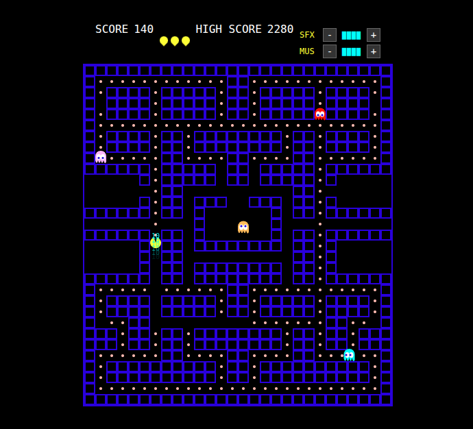

# PAC-MAN

Classic arcade PAC-MAN game built with HTML5 Canvas and JavaScript.



## About

This project was built collaboratively using **OpenCode** with [Superpowers Skills](https://github.com/obra/superpowers) by **@obra**, powered by **DeepSeekV4-Flash** routed through **[OminiRoute](https://omniroute.online/)** as the AI provider gateway.

### Features

- Full maze, ghost AI (Blinky, Pinky, Inky, Clyde), power pellets, and fruit
- Scatter/Chase mode cycling with frightened mode
- Ghost eat combo scoring (200, 400, 800, 1600)
- Web Audio API sound effects and music
- Volume controls with mute toggles
- High score persistence via localStorage

## Sound Assets

Sound effects sourced from [Spriter's Resource](https://sounds.spriters-resource.com/arcade/pacman/asset/404131/).

## Deploy

Static site — deploy anywhere. Vercel config included.

```bash
npx vercel --prod
```

## Controls

| Key | Action |
|---|---|
| Arrow keys / WASD | Move Pac-Man |
| `M` | Toggle mute |
| `Shift+S` | Toggle SFX mute |
| `Shift+M` | Toggle music mute |

## Tech Stack

- **HTML5 Canvas** — rendering
- **Web Audio API** — sound
- **Vanilla JS** — no framework
- **Vercel** — deployment
